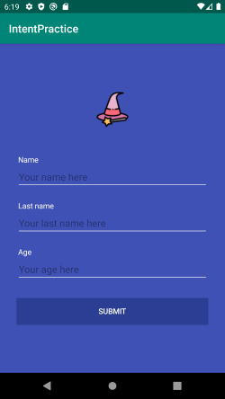
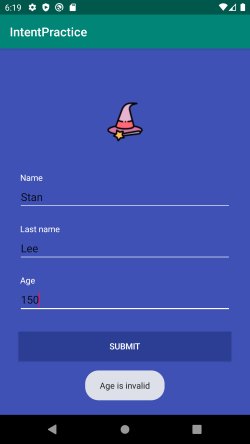
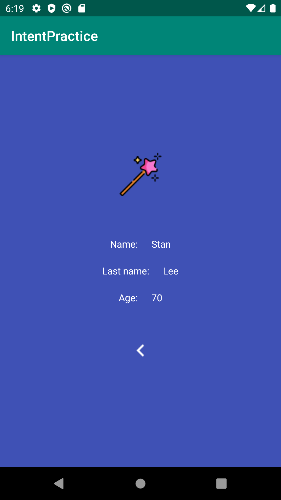

# Intent and Sending Data
In this app, intent is created to pass data from one activity to another.

In main activity user provides name, last name and age. All fields should be filled and age must be valid in order to continue to the next activity.
If this is the case; when user clicks the button, data that the user provides are sent to the second activity and displayed.

The back arrow button on the second activity lets user to come back to the main activity. With the button click, second activity is popped out of the activity stack.

## Screenshots
### Main activity
  

### Second activity
